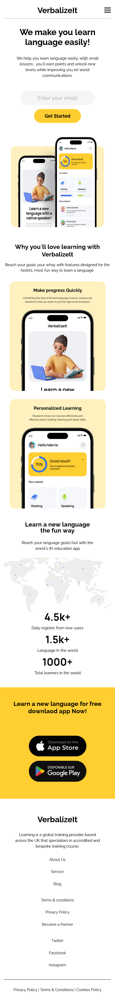

# VerbalizeIt

VerbalizeIt is a simple language learning website designed based on a Figma design. The website is coded using HTML, CSS, and JavaScript, focusing on creating a responsive and accessible user interface.

## Features

- **Responsive Design**: The website layout is responsive, adjusting to different screen sizes using CSS media queries. The design works seamlessly on both desktop and mobile devices.
- **Accessible**: The website follows accessibility guidelines, ensuring it is usable by people with disabilities. It includes proper semantic HTML, alt text for images, and keyboard navigation support.

## Technologies Used

- **HTML**: Provides the basic structure of the website, using semantic elements to improve accessibility.
- **CSS**: Styling the website, with a focus on responsiveness through CSS media queries. Flexbox and Grid are utilized for layout management.
- **JavaScript**: Added interactivity to the page, such as event listeners for user interactions and dynamic content updates.

## Logic and Functionality

- **Responsive Layout**: CSS media queries are used to ensure the website layout adjusts to various screen sizes, providing a consistent experience across desktop, tablet, and mobile devices.
- **Accessibility**: The website follows best practices for accessibility, including:
  - Use of semantic HTML elements such as `<header>`, `<main>`, `<footer>`, and `<nav>`.
  - Alt text for images to support screen readers.
  - Keyboard navigability for interactive elements.

## Live Preview

You can view a live version of this project at the following URL:

[Live Preview](https://lovely-quokka-008339.netlify.app)

## Screenshots

Here are some screenshots of the Spring project:

_Homepage View_

_Mobile View_
